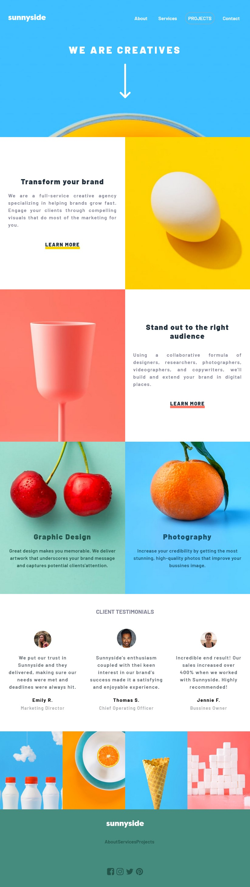

# Frontend Mentor - Sunnyside agency landing page solution

This is a solution to the [Sunnyside agency landing page challenge on Frontend Mentor](https://www.frontendmentor.io/challenges/sunnyside-agency-landing-page-7yVs3B6ef). Frontend Mentor challenges help you improve your coding skills by building realistic projects.

## Table of contents

- [Overview](#overview)
  - [The challenge](#the-challenge)
  - [Screenshot](#screenshot)
  - [Links](#links)
- [My process](#my-process)
  - [Built with](#built-with)
  - [What I learned](#what-i-learned)
  - [Continued development](#continued-development)
- [Author](#author)

**Note: Delete this note and update the table of contents based on what sections you keep.**

## Overview

### The challenge

Users should be able to:

- View the optimal layout for the section depending on their device's screen size

### Screenshot

<<<<<<< HEAD

=======

>>>>>>> 0dfe360eaacbb43810766bf50085124f4cbca37a

### Links

- Solution URL: [https://github.com/soitirakis/sunnyside](https://your-solution-url.com)
- Live Site URL: [https://soitirakis.github.io/sunnyside/](https://your-live-site-url.com)

## My process
- Mobile-first workflow 
- Started from top to bottom: header, nav, main, aside, footer

### Built with

- Semantic HTML5 markup
- CSS custom properties
- CSS Flexbox
- CSS Grid
- Mobile-first workflow
- Javascript for the Menu Icon

### What I learned
Through this project I was able to review some of the CSS Flexbox and Grid procedures. 
I have had reviewed the flow procedures. Getting the right section in it's right position. 
I have become more confortable with Modal Navbar usign Javascript.  

### Continued development
The next chapter would be to implement a modal gallery for the gallery section of the webpage. So, if 
you click on an image, the image will expand to fullscreen, with a small caption beneath. Probably it 
will be implemented using the same modal principal as for the nav collapse. 

## Author

- Frontend Mentor - [@Padawan](https://www.frontendmentor.io/profile/soitirakis)
- Twitter - [@AndreiCAnghel](https://www.twitter.com/AndreiCAnghel)

